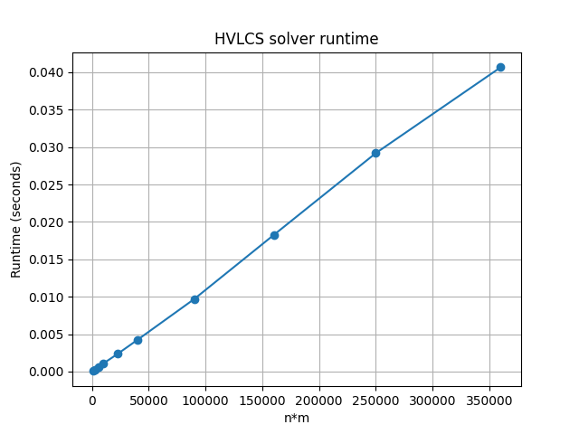

# Programming Assignment 3 - Highest Value Common Subsequence

**Name:** Pablo Pupo
**UFID:** 96796601

## Problem

Given an alphabet of K characters where each character has a nonnegative
integer value, and two strings A and B, find a common subsequence of A
and B with the maximum total value. Output both the value and one such
subsequence.

## Layout

```
highest-value-lcs/
    src/
        main.py          (entry point, arg parsing and file I/O)
        hvlcs.py         (input parser, DP solver, reconstruction)
    data/
        example.in       (worked example from the assignment PDF)
        example.out      (expected output for example.in)
        test1.in ... test10.in   (10 randomly generated test inputs)
        runtimes.png     (runtime plot produced by scalability.py)
    testing/
        generator.py     (random input file generator)
        scalability.py   (times the solver on the test files and plots)
```

## Build and Run

Needs Python 3. No compile step. The solver itself has no third-party
dependencies. `testing/scalability.py` uses `matplotlib` for the plot.

From the project root:

```
python src/main.py example.in
```

This reads `data/example.in`, runs the DP, prints the max value and
one optimal subsequence, and writes the same thing to
`data/example.out`. For the included example you should see:

```
9
cb
```

If you leave off the filename it defaults to `example.in`. The repo
also ships 10 randomly generated test files (`data/test1.in` through
`data/test10.in`, string lengths 25 to 600) which can be run the same
way, e.g. `python src/main.py test5.in`.

To generate your own random input file:

```
python testing/generator.py <n> <filename>
```

To re-run the scalability measurements and redraw the runtime plot:

```
python testing/scalability.py
```

## Input format

```
K
x1 v1
x2 v2
...
xK vK
A
B
```

- K is the alphabet size.
- The next K lines each give a character and its nonnegative integer value.
- A and B are the two strings, on their own lines.

## Assumptions

- Characters are single printable, non-whitespace symbols and are case-sensitive.
- Every character appearing in A or B is listed in the alphabet section. Any character not in the alphabet falls back to value 0.
- Values are nonnegative integers, as stated in the problem.

## Question 1: Empirical Comparison

I generated 10 input files with string lengths 25, 50, 75, 100, 150,
200, 300, 400, 500, and 600, all over a 4-letter alphabet `{a,b,c,d}`
with random values. Both strings in each file are the same length so
the DP table is n x n. For each file I ran the solver 5 times and kept
the fastest run to cut down on noise. The numbers below came from
`python testing/scalability.py` on my machine:

| file | n | m | n*m | time (s) |
|---|---|---|---|---|
| test1.in | 25 | 25 | 625 | 0.000070 |
| test2.in | 50 | 50 | 2500 | 0.000266 |
| test3.in | 75 | 75 | 5625 | 0.000585 |
| test4.in | 100 | 100 | 10000 | 0.001090 |
| test5.in | 150 | 150 | 22500 | 0.002365 |
| test6.in | 200 | 200 | 40000 | 0.004242 |
| test7.in | 300 | 300 | 90000 | 0.009695 |
| test8.in | 400 | 400 | 160000 | 0.018252 |
| test9.in | 500 | 500 | 250000 | 0.029200 |
| test10.in | 600 | 600 | 360000 | 0.040670 |



Runtime grows roughly linearly with n*m, which matches the O(n*m) DP.
Each cell of the (n+1) by (m+1) table only does constant work. Going
from test5 (n=150) to test10 (n=600) is 16x more cells and about 17x
more time, which is basically the linear scaling you'd expect.

## Question 2: Recurrence

Let dp[i][j] be the maximum total value of a common subsequence of
A[1..i] and B[1..j]. Let v(c) be the value of character c.

Base cases:

```
dp[0][j] = 0   for all j in 0..m
dp[i][0] = 0   for all i in 0..n
```

An empty prefix of either string can only match the empty subsequence,
which has value 0.

Recurrence:

```
if A[i] == B[j]:
    dp[i][j] = dp[i-1][j-1] + v(A[i])
else:
    dp[i][j] = max(dp[i-1][j], dp[i][j-1])
```

Why it's correct. Take any optimal common subsequence S of A[1..i] and
B[1..j]. There are two cases for whether the last matched pair in S is
(A[i], B[j]):

1. S ends with that pair. This requires A[i] == B[j]. Drop the last
   character from S and you get a common subsequence of A[1..i-1] and
   B[1..j-1], whose best value is dp[i-1][j-1]. Adding v(A[i]) back
   gives dp[i][j] = dp[i-1][j-1] + v(A[i]). And going the other way,
   we can always take an optimal subsequence of A[1..i-1] and B[1..j-1]
   and append the matched pair (A[i], B[j]), so dp[i][j] is at least
   dp[i-1][j-1] + v(A[i]). Both directions give equality.

2. S does not end with (A[i], B[j]). Then either A[i] is unused in S,
   in which case S is a common subsequence of A[1..i-1] and B[1..j]
   (so its value is at most dp[i-1][j]), or B[j] is unused, in which
   case S is a common subsequence of A[1..i] and B[1..j-1] (value at
   most dp[i][j-1]). Either way dp[i][j] = max(dp[i-1][j], dp[i][j-1])
   in this case. And both dp[i-1][j] and dp[i][j-1] are obviously
   achievable on A[1..i], B[1..j] too, so we get equality.

When A[i] == B[j] both cases are legal, but since values are
nonnegative, matching A[i] and B[j] can never lower the total value.
So the first branch is always at least as good as the second, and
that's why the match case just uses dp[i-1][j-1] + v(A[i]) instead of
a three-way max. When A[i] != B[j] only case 2 can happen.

## Question 3: Big-Oh

Pseudocode for computing the maximum HVLCS value:

```
HVLCS_VALUE(A[1..n], B[1..m], v):
    let dp be a (n+1) by (m+1) array, all zeros
    for i from 1 to n:
        for j from 1 to m:
            if A[i] == B[j]:
                dp[i][j] = dp[i-1][j-1] + v(A[i])
            else:
                dp[i][j] = max(dp[i-1][j], dp[i][j-1])
    return dp[n][m]
```

Runtime. The two nested loops fill n*m cells, and each cell does a
constant amount of work: one character comparison, one lookup of
v(A[i]), and at most one addition or one comparison. Parsing the
alphabet is O(K) and reading the two strings is O(n + m). The total
runtime is

```
O(K + n + m + n*m) = O(n*m)
```

since n*m dominates once the strings are nontrivial. Space is also
O(n*m) because of the DP table. Reconstructing one optimal subsequence
by walking back from dp[n][m] is an extra O(n + m) and doesn't change
the asymptotic runtime.
